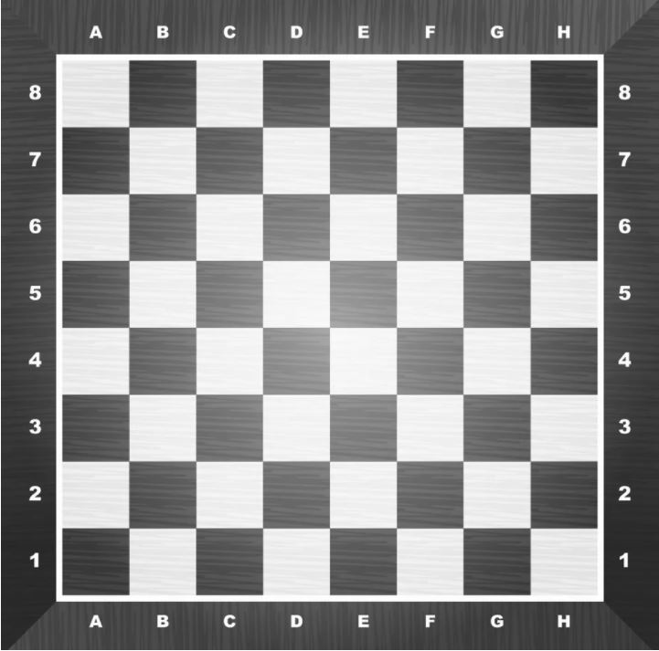

<style>
h1.title {
  font-size: 30px;
}
h1 {
  font-size: 26px;
}
h2 {
  font-size: 22px;
}
h3 { 
  font-size: 18px;
}

</style>
# Article
This article is an exhaustive description of the author's opinions on the best, worse, odd, popular and all sorts of openings.
https://www.ichess.net/blog/best-chess-opening-moves/

# Idea
I will use a dataset of chess games to analyze how effective the author's ideas are, depending on players' ratings.

# (Relevant) Variable Description
https://www.kaggle.com/datasnaek/chess
I got a dataset from kaggle with almost 20 thousand different games. The variables I am going to use are the following:<br>
- white_rating <br>
- black_rating <br>
- winner <br>
- moves <br>
<br>
white_rating is a number that will range from about 600 to 2700 indicating the rating the player playing white had <br>
black_rating indiactes the rating the player playing black had <br>
winner indicates who won: white, black or tie. <br>
moves is a string separated by space with the coordinates for every move in a game.

# Chess Board
<br>

```{r include=FALSE}
library(rsconnect)
library(tidyverse)
library(shiny)
library(shinythemes)
library(dplyr)
#games<-read.csv("/Users/Cesar Godoy/Desktop/3year/DS/assignment17/games.csv")
games<-read.csv("games.csv")
head(games)
```
# Data Validation{.tabset}
Now that we have a dataset, let's validade the data.

## Check Null and Unique
Check for null values for the variables we intend to use, and get rid of repeated values.
```{r}
paste(c("Initially there were", nrow(games),"rows"), collapse = " ")
games<-games %>% drop_na(
  white_rating,
  black_rating,
  winner,
  moves
)
paste(c("After dropping nulls there were", nrow(games),"rows"), collapse = " ")
games <- unique(games)
paste(c("After dropping repeated rows there were", nrow(games),"rows"), collapse = " ")
```
## Tiers
In order to analyze enough games, let us group the players playing them into tiers
```{r}
for(i in c(0:36)){
  games$white_rating[which((as.numeric(games$white_rating)<=700+200*i+100)&as.numeric(games$white_rating)>700+200*i-100)] <- 700+200*i
   games$black_rating[which((as.numeric(games$black_rating)<=700+200*i+100)&as.numeric(games$black_rating)>700+200*i-100)] <- 700+200*i
}
```
## Moves
We need access to the moves themselves, so let us use some regex to segregate the first move white and black played from the rest of the game.
```{r}
for(item in c(1:nrow(games))){
  #get first white move
  games$w1[item] <-substr(games$moves[item],1,str_locate(games$moves[item], "^([A-Z]|[a-z])+[0-9]")[2])
  #change moves string to remove first white move
  games$moves[item] <- substr(games$moves[item],str_locate(games$moves[item], "^([A-Z]|[a-z])+[0-9]")[2] + 2,nchar(games$moves[item]))
  #get first black move
  games$b1[item] <-substr(games$moves[item],1,str_locate(games$moves[item], "^([A-Z]|[a-z])+[0-9]")[2])
}
```
## Analysis
Let us create the dataset we will use to actually analyze things. Let's not forget to get rid of moves with less than at least 10 occurences, since that may have very little statistical value
```{r}
#make dataframe we'll use to analyze white
gamesW <- data.frame(
  move1 = games$w1,
  black_rating = games$black_rating
)
#make dataframe we'll use to analyze black
gamesB <- data.frame(
  moveW1 = games$w1,
  move1 = games$b1,
  white_rating = games$white_rating
)
#this will have duplicated items. count them
gamesW<-gamesW %>% group_by(black_rating,move1)%>%summarise(n = n(), .groups = "keep")
gamesB<-gamesB %>% group_by(white_rating,move1,moveW1)%>%summarise(n = n(), .groups = "keep")

#if there aren't at least 10 games with an opening, it's not enough for it to have any statistical significance
gamesW<-gamesW[(gamesW$n>=10),]
gamesW$Pwin_move1 <- c(1:nrow(gamesW))
gamesB<-gamesB[(gamesB$n>=10),]
gamesB$Pwin_move1 <- c(1:nrow(gamesB))
```
## Adversary Rating
Now let us add to each dataset one side's(white or black) first move along with its adversary's rating - we gotta know what works against each tier. 
```{r}
#get chance of winning per ADVERSARY rating and first move
for(i in c(1:nrow(gamesW))){
  brating <- gamesW$black_rating[i]
  mw1 <- gamesW$move1[i]
gamesW$Pwin_move1[i] <- nrow(games[(games$black_rating == brating & games$winner == "white"&games$w1==mw1),])/nrow(games[(games$black_rating==brating & games$w1==mw1),])
}
#For black, take into consideration first move white
for(i in c(1:nrow(gamesB))){
  wrating <- gamesB$white_rating[i]
  mw1 <- gamesB$moveW1[i]
  mb1 <- gamesB$move1[i]
  gamesB$Pwin_move1[i] <- nrow(games[(games$white_rating == wrating & games$winner == "black"&games$b1==mb1&games$w1==mw1),])/nrow(games[(games$white_rating==wrating & games$b1==mb1&games$w1==mw1),])
}
```
## {-}

# Plot
```{r}
ui <- navbarPage(
  theme = shinytheme("cosmo"),
  # Application title
  title="Most Effective Moves",
  tabPanel("White",plotOutput("whiteMoves"),
      sliderInput("black_rating", label = "Rating Adjustment:",
              min = 900, max = 2500, value = 1500, step = 200)),
  tabPanel("Black",plotOutput("blackMoves"),
           sliderInput("white_rating", label = "Rating Adjustment:",
              min = 900, max = 2500, value = 1500, step = 200),
    radioButtons("firstWhite", "white moved", unique(gamesB$moveW1),inline=TRUE)
  )
)

# Server logic
server <- function(input, output) {
  whiteRate <- reactive({
    tempW<-gamesW[(gamesW$black_rating==input$black_rating),]
    return(tempW)
    })
   blackRate <- reactive({
     tempB<-gamesB[(gamesB$white_rating==input$white_rating),]
     tempB<-tempB[(tempB$moveW1==input$firstWhite),]
     return(tempB)
    })
  
  output$whiteMoves <- renderPlot({
    ggplot(whiteRate(), aes(x=move1,y=Pwin_move1))+geom_bar(stat = "identity", color = "black") + coord_cartesian(ylim = c(0, 1)) + scale_y_continuous(breaks = seq(0, 1, by = 0.1)) + labs(title = "White Moves") + ylab("Percentage of Won Games") + xlab("Move") + geom_col(fill="white")
  })
  output$blackMoves <- renderPlot({
    ggplot(blackRate(), aes(x=move1,y=Pwin_move1))+geom_bar(stat = "identity", color = "white") + coord_cartesian(ylim = c(0, 1)) + scale_y_continuous(breaks = seq(0, 1, by = 0.1)) + labs(title = "Black Moves") + ylab("Percentage of Won Games") + xlab("Move") + geom_col(fill="black")
  })
}
shinyApp(ui = ui, server = server, options = list(height = 500))
```

# Conclusion{.tabset}
Because we only have 20 thousand games, we have to limit ourselves to just a few moves. Though 20 thousand may sound like a lot, games are distributed among tears and black's first move is already conditional. Because of the possibilities in chess, 20 thousand becomes a small amount of games to analyze really quickly - which is perhaps the greatest limitation in this paper. Other limitations include the rating, as it's not an official rating and merely done by the online tool and the idea that people are not necessarily playing with 100% of attention every time.<br>

## Quote 1
"The best opening chess moves are 1.e4, 1.d4, 1.Nf3, and 1.c4." 
<br>
It seems that these move are pretty effective for lower rated players, but for players that already know the mainlines, it seems like this opening is not as effective, and sometimes the winning rate of players who open with these moves is even lower than 50%.

## Quote 2
"Other similar-looking moves like 1.f4 and 1.Nc3 aren’t as strong. Moving the f-pawn weakens the king’s protection, and 1.Nc3 blocks the c-pawn from being moved. In addition, 1.Nc3 doesn’t really control the center as Black can still play 1…d5."
<br>
f4 and Nc3 don't seem to be played that often in lower level games and in midtear games they will even outperform the alleged best moves. I believe that the adversary not knowing the mainline for these openings would be the biggest reason for that. But in general, it is true that moves mentioned in quote 1 outperform these. It also seems like we don't have that much information on people playing Nc3, and the only rating where that happens enough is 1500 where they respond with e4 and lose most of the time. 
## Quote 3
"Chess moves such as 1.e3, 1.d3 or 1.c3 are playable and do not weaken White’s position. Against these openings the best opening chess moves for black are the simple 1…e5 and 1…d5"
<br>
these seem to be very ineffective moves by white around the board. It doesn't look like they happen very often in higer rated games. When they do happen(in lower rated games), it seems like black win overwhelmingly.

## Quote 5
"After 1.e4, Black can respond in many different ways. They might mimic your move with 1…e5 – the so-called “open games.” Other possibilities include attacking the center from the wing (1…c5, the Sicilian Defense) and delaying the fight for the center by preparing first with moves like 1…e6 and 1…c6."
<br>
It looks like against lower rated players, these responses by black will very often lead to victory. Against higher rated players, these moves still seem effective, but they have a lower chance than white of victory.

## Quote 6
"The move 1…Nf6 is one of the best opening chess moves for black against 1.d4."
<br>
It does seem like this move is one of the more effective ones against any rated white player.


## Quote 7
"Playing an early …c5 is one of the best opening chess moves for black against 1.d4"
<br>
It's not a very common move to see in lower rated games, and it doesn't seem particularly effective.

## {-}


